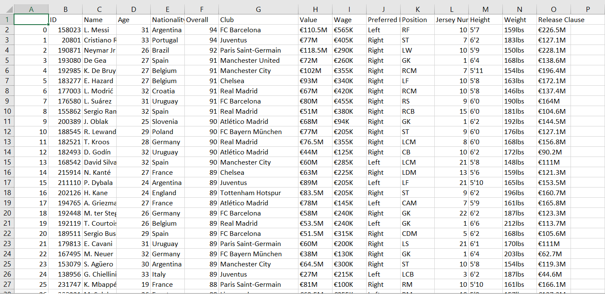

# DSA-project

This Project was made to test our Data Structures and ALogorithms logic. We used a data set of FIFA 19, and organized it using Arrays, Linked List, AVL trees and graphs. Technology used for making this application was Qt creator in C++. 

To keep track of players, clubs and countries, we used AVL trees where each node represents a player, country or club. 

Sample data for data.csv is given below: 

