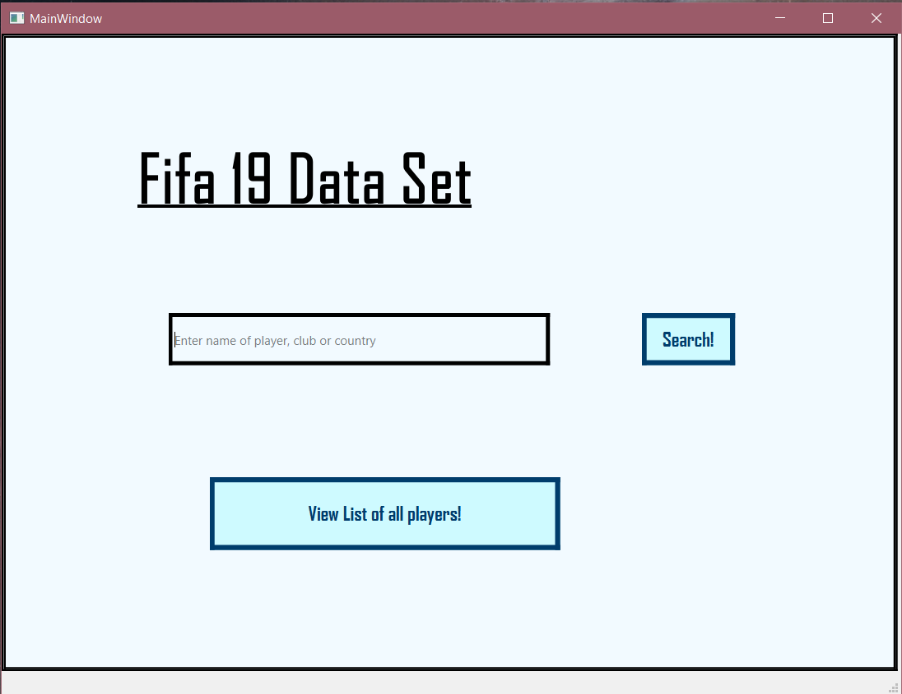
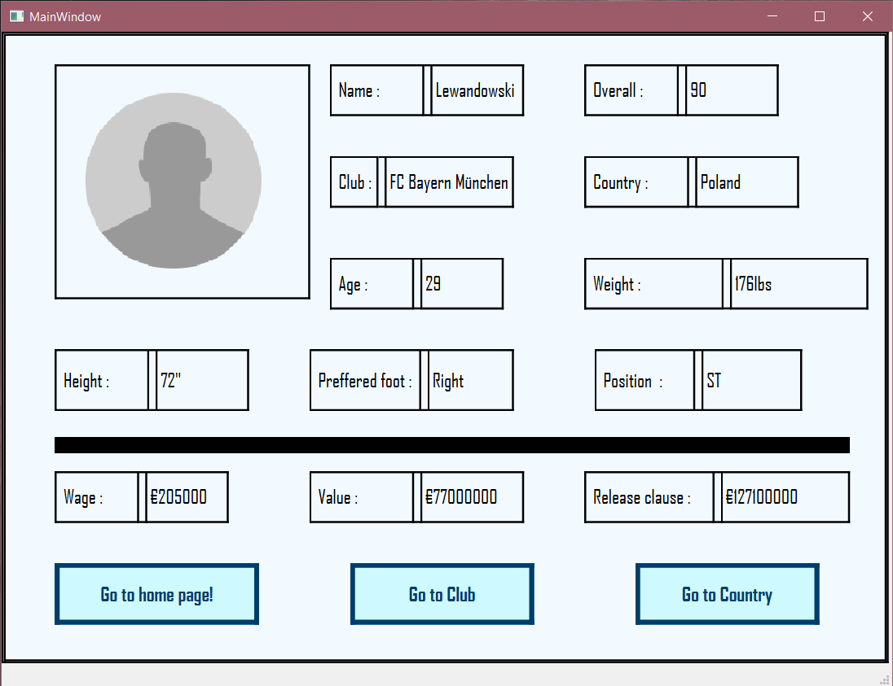
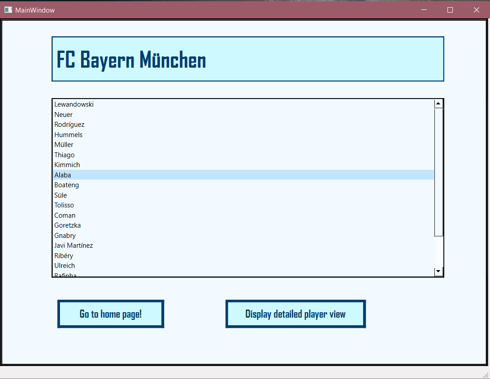

# DSA-project

This Project was made to test our Data Structures and ALogorithms logic. We used a data set of FIFA 19, and organized it using Arrays, Linked List, AVL trees and graphs. Technology used for making this application was Qt creator in C++. 

To keep track of players, clubs and countries, we used AVL trees where each node represents a player, country or club. 

Sample data for data.csv is given below: 

 
 

Now moving on to Application, We can search a player, club or country using the Search bar given below: 

we will search for player Lewandowski, following are the results where his all statistics are being showed.  

  
  

Now we can go to his club or country, we will first see his club. 

  
  

